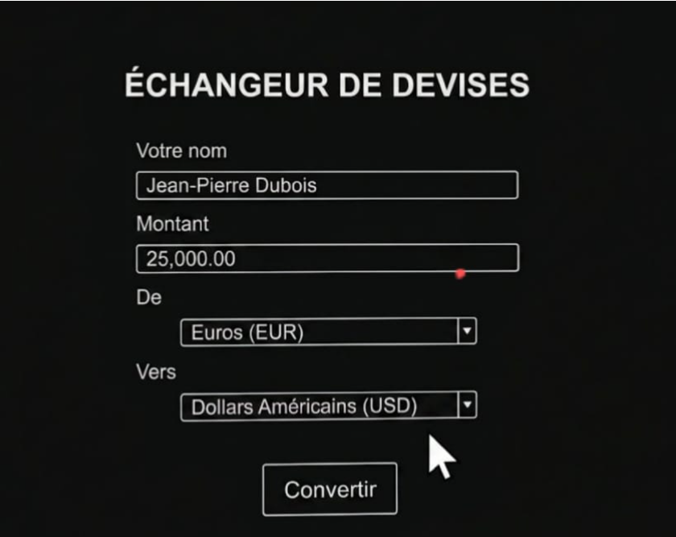

#  Échangeur FF (`echangeurff.py`)

**Échangeur FF** est une application bureau légère et intuitive de conversion de devises, développée en Python avec Tkinter. Conçue avec un mode sombre (*Dark Mode*) en plein écran, elle assure un calcul rapide tout en intégrant un contrôle strict de la saisie utilisateur.

---

##  Pourquoi ce nom : `echangeurff.py` ?

Le nom **Échangeur FF** réunit les concepts clés du projet :

* **Échangeur** : Fait référence à la fonction centrale de l'application (l'échange et la conversion de devises).
* **FF** :
  * **Francs & Foreign currencies** : Rappelle la monnaie de départ principale (**Franc FCFA**) convertie vers d'autres devises internationales.
  * **Fast & Functional** : Souligne l'immédiateté des calculs et la simplicité du formulaire.
* **.py** : L'extension du script Python.

---

## 🎥 Démonstration en Vidéo et Captures

### 📸 Aperçu de l'interface

| **Interface Principale (Plein écran)** | **Contrôle de saisie (Pop-up d'erreur)** |
| :---: | :---: |
|  |  |

> *Astuce : Place tes captures d'écran dans un dossier `docs/` à la racine du projet.*

###  Vidéo de démonstration
 text
▶ Regarder la vidéo de démonstration (demo.mp4)
 

---

##  Fonctionnalités

* **Interface immersive :** Mode sombre (*Dark Mode*) plein écran pour éviter la fatigue visuelle.
* **Sécurisation des données (Validation dynamique) :**
  * **Nom :** Refuse les chiffres et caractères spéciaux (Affiche : *« Le nom ne doit contenir que des lettres ! »*).
  * **Montant :** Refuse le texte et les valeurs négatives ou nulles (Affiche : *« Veuillez entrer un nombre valide en chiffres ! »*).
* **Calcul via monnaie pivot :** Conversion précise s'appuyant sur le Franc FCFA vers le Dollar ($), l'Eco, le Naira (₦) ou le Cedi (₵).
* **Affichage dynamique :** Message de confirmation personnalisé incluant le nom de l'utilisateur et le résultat formaté.

---

##  Prérequis système

Avant d'exécuter l'application, assurez-vous d'avoir :

* **Python 3.8 ou supérieur** : [Télécharger Python](https://www.python.org/downloads/)
* **Tkinter** (Généralement inclus avec Python sous Windows/macOS).
  * *Pour les utilisateurs Linux (Ubuntu/Debian) :*
    ```bash
    sudo apt-get install python3-tk
    ```

---


